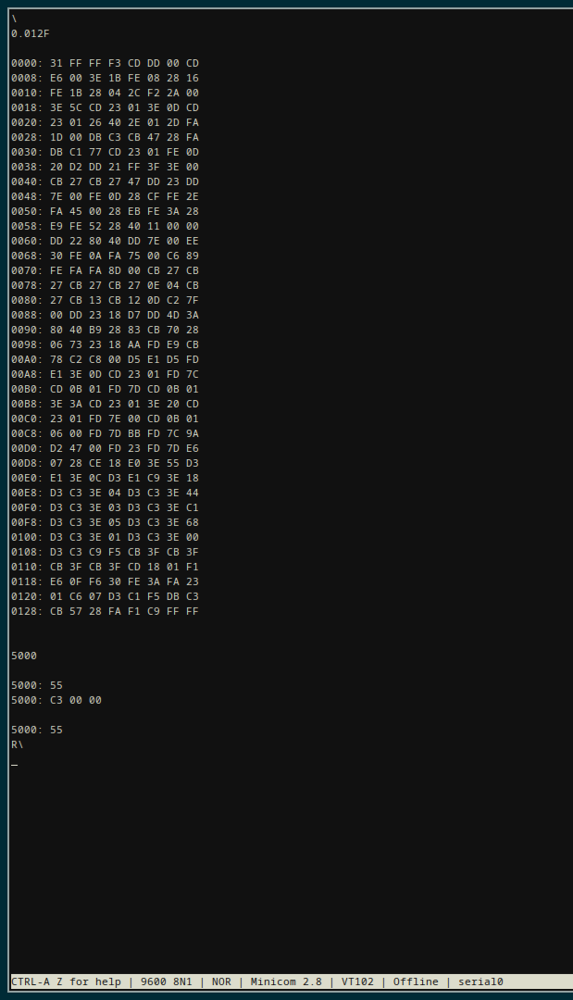

# ZMon

Wozmon (written by Steve Wozniak in 1976) created for the Z80 and Z80-family of peripherals.

The ZMon hex monitor runs in EEPROM (16k) space from address `0x0000`. The input buffer is placed in
RAM (48k) at `0x4000` to `0x407F`, with one additional word necessary (`0x4080`, `0x4081`). The
stack is initialised to the top of RAM at `0xFFFF`.

The monitor uses UART over the SIO peripheral; 8 bits, 1 stop bit, no parity, 9600 baud.

I/O mapping is as follows:

- `0xC0` - SIO (Serial Input/Output)
- `0xE0` - CTC (Counter/Timer Circuit)

## Contributing

I use [Vasm](http://www.compilers.de/vasm.html) oldstyle to assemble this project.

Currently, ZMon is 253 bytes in size _without I/O initialisation_. The additional size to initialise
the CTC and SIO are 45 bytes. I'm willing to accept any kind of space optimisations to also fit in
I/O initialisation in the 256 byte limit so it's self-contained in 256 bytes.
